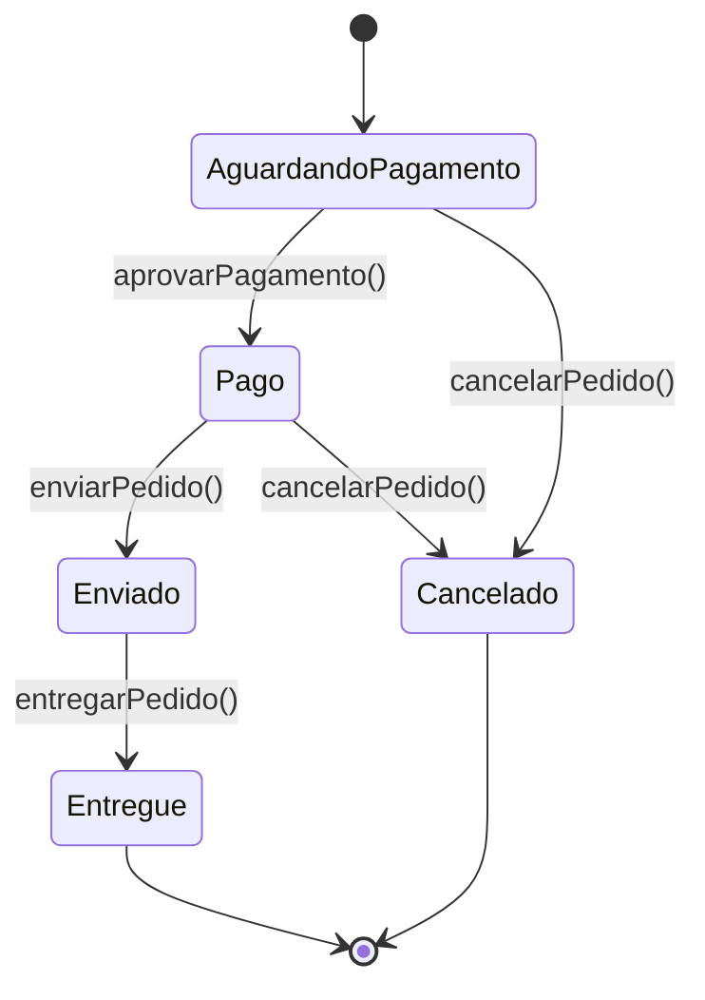
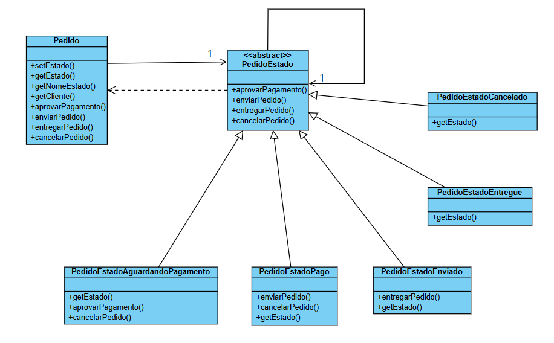

# Padrão de Projeto State

Este repositório é um exemplo prático da implementação do padrão de projeto **State** em Java. O padrão State é um padrão comportamental que permite a um objeto alterar seu comportamento quando seu estado interno muda. O objeto parecerá ter mudado de classe.

Este projeto demonstra o padrão através do Ciclo de Vida de um Pedido. Gerencia as etapas de um pedido de e-commerce.

## Ciclo de Vida do Pedido

Simula o fluxo de um pedido em um sistema de e-commerce. O objeto de contexto é o `Pedido`, e seu comportamento (aprovar pagamento, enviar, cancelar) muda dependendo do seu estado atual.

### Estados do Pedido

Um `Pedido` pode existir nos seguintes estados:

* **AguardandoPagamento:** O estado inicial. O pedido foi criado, mas aguarda a confirmação do pagamento.
* **Pago:** O pagamento foi aprovado. O pedido agora pode ser preparado para envio.
* **Enviado:** O pedido foi despachado para o cliente.
* **Entregue:** O cliente confirmou o recebimento do pedido (estado final).
* **Cancelado:** O pedido foi cancelado (estado final).

### Diagrama de Transição de Estados (Pedido)

O diagrama abaixo mostra as transições válidas entre os estados, que são gerenciadas pelas classes de estado concretas:

### Estrutura das Classes (Pedido)

* `Pedido`: A classe de contexto que mantém a referência ao seu estado atual (`PedidoEstado`).
* `PedidoEstado`: A classe abstrata que define a interface para todos os estados.
* `PedidoEstadoAguardandoPagamento`: Estado concreto. Permite transições para `Pago` ou `Cancelado`.
* `PedidoEstadoPago`: Estado concreto. Permite transições para `Enviado` ou `Cancelado`.
* `PedidoEstadoEnviado`: Estado concreto. Permite transição para `Entregue`.
* `PedidoEstadoEntregue`: Estado final. Não permite transições.
* `PedidoEstadoCancelado`: Estado final. Não permite transições.
* `PedidoTest`: Classe de testes (JUnit 5) que valida todas as transições de estado (válidas e inválidas).

## Diagrama de Classes

